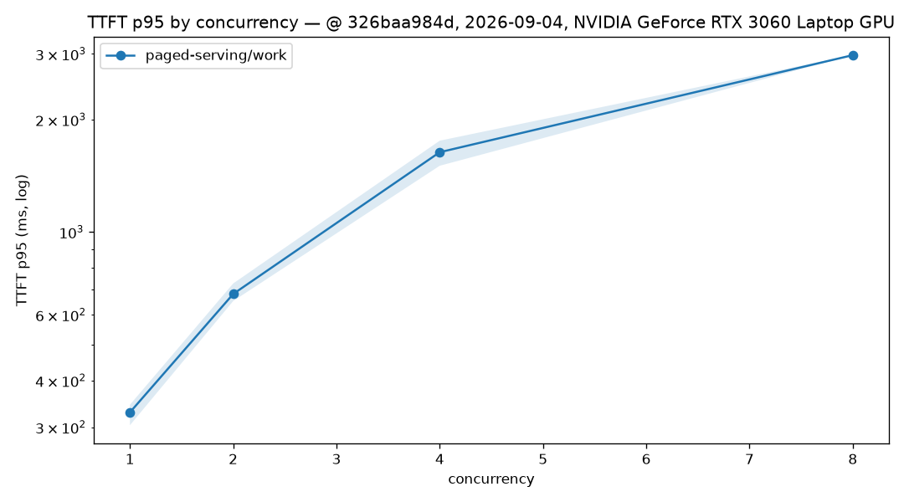
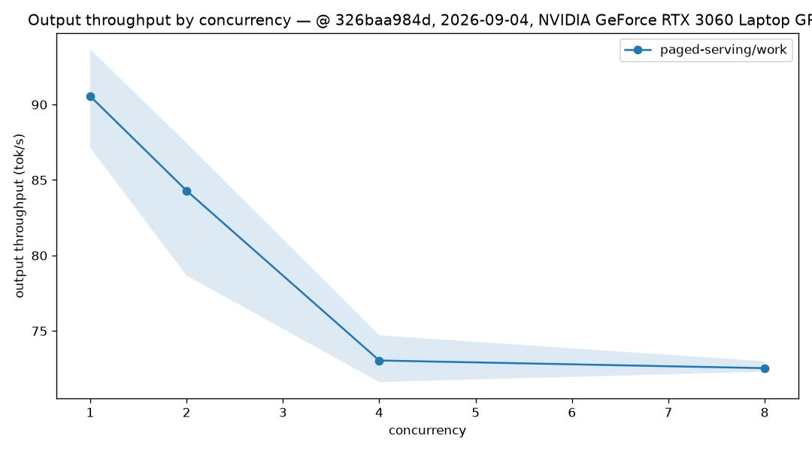
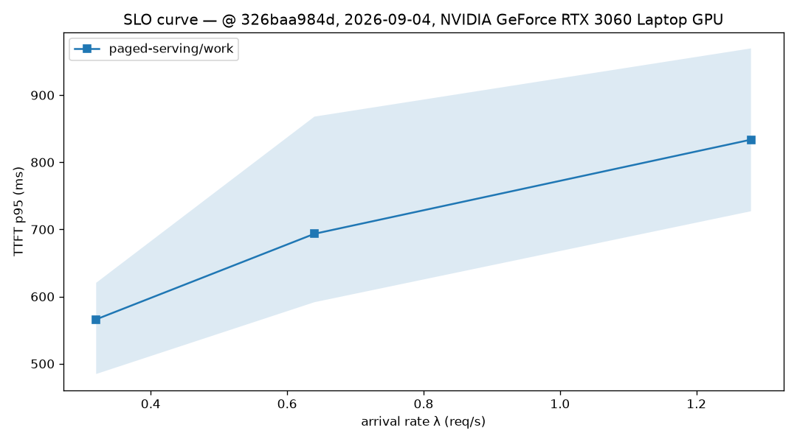

# RTX 3060 Laptop：paged-serving + tiny-llm P2 流式矩阵

## 范围与结论

- 日期：2026-09-04（sweep 起始日期）；发压机与服务同机。
- 硬件：NVIDIA GeForce RTX 3060 Laptop GPU（6144 MiB）、AMD Ryzen 7 5800H、
  NVIDIA driver 610.88、CUDA toolkit 12.0。笔记本 GPU 的功耗墙、散热与同机发压
  都是本次口径的一部分，不能外推到桌面卡或数据中心 GPU。
- 被测代码：paged-serving `326baa984d44d6e09d6f7d89b91dcd6d95b02e8a`，
  tiny-llm `6df2c59b8db5ec409cf214a764e2f4eae84216d8`；sweep 起始时两仓均为
  clean worktree。
- 模型：`qwen2.5-0.5b-instruct-q4_k_m.gguf`，Q4_K_M，SHA-256
  `74a4da8c9fdbcd15bd1f6d01d621410d31c6fc00986f5eb687824e7b93d7a9db`；tokenizer
  为同工作区的 `models/tokenizer.json`。
- 这次 P2 矩阵验证了当前 HuggingFace 流式路径：成功请求可在生成途中发送非空文本
  chunk，因而 TTFT 是可观察的首文本延迟，而非 P1 中整段响应结束时间。closed-loop
  从并发 1 到 8 时，平均输出吞吐从 90.553 降至 72.538 tok/s，TTFT p95 从
  328.660 升至 2976.000 ms。它支持“控制面可以组 batch、计算仍未 fused”的边界判断，
  **不**证明 continuous batching 的吞吐扩展。

本包是完整矩阵归档，但不能作为精确 SLO 或跨版本速度提升结论：按本项目
`(max - min) / mean > 10%` 的重复波动门槛，closed c1/c2/c4 的 TTFT p95 未收敛，
closed c2 的吞吐也未收敛；三档 Poisson TTFT p95 均未收敛。所有均值、范围、429
与原始逐请求记录仍完整保留，供后续冷却/独立发压机复跑时对照。

## 正确性门控

- release 服务以 `--features tiny-llm` 构建，并显式使用
  `--backend tiny-llm --model-path <gguf>`；启动后 `/healthz` 与 `/readyz` 均返回
  200。此选择避免只因编译 feature 启用而静默落到 CPU reference。
- 同一代码路径的
  [P2 流式功能 canary](../2026-09-04-RTX3060Laptop-paged-serving-p2-stream-canary/)
  已归档：closed 与 Poisson 各一请求均得到 16 个可见文本 chunk 与 15 个分片间隔样本。
- 本正式矩阵 closed-loop 12 个 run 均为 64/64 成功；每个成功请求都从最终 SSE `usage`
  取得 completion token，所有 run 的 token coverage 均为 100%。
- 21 个 run 共提交 1344 请求，1233 个成功；其余 111 个失败全部是 Poisson 准入时的
  HTTP 429，没有 timeout、连接或流协议错误。每个成功请求都记录到 128 个非空文本
  chunk（对应本模型/负载下的 128 completion tokens）；这不是对所有 tokenizer 或特殊
  token 序列都“一 token 一 chunk”的通用承诺。
- `inter-chunk latency` 是相邻**非空文本 chunk** 的到达间隔，只描述协议粒度，
  不是 token 级 ITL；协议没有 token 时间戳，故 ITL 一律记为不可用。
- P1 的历史包使用旧的缓冲 HF 解码器，TTFT 接近整段响应完成时间。两包的流式语义不同，
  不做 P1→P2 TTFT/TPOT 的 before/after 性能比值。

## 负载与结果

共同参数：`work` 合成数据集（200 条）、greedy、`max_tokens=128`、每组合 64 个测量
请求、30 秒同形态预热、3 次重复。服务端为 `max_num_seqs=8`、`max_batch_size=8`，
环境包含 `PAGED_SERVING_TINY_LLM_MAX_SEQS=8` 与
`PAGED_SERVING_TINY_LLM_DECODE_RESERVE=128`。图表和逐 run 原始数据均在本目录。

### Closed-loop

所有 closed-loop run 为 64/64 成功、无 429。下表的 p95 与吞吐是三次均值，范围是
三次的 min/max；`chunk p50` 不可当作 ITL。

| 并发 | TTFT p95 (ms) | p95 范围 (ms) | chunk p50 (ms) | TPOT p50 (ms) | 输出吞吐 (tok/s) | 吞吐范围 (tok/s) |
| ---: | ---: | ---: | ---: | ---: | ---: | ---: |
| 1 | 328.660 | 303.585–344.459 | 7.959 | 8.959 | 90.553 | 87.143–93.653 |
| 2 | 682.118 | 653.032–727.816 | 18.300 | 19.461 | 84.296 | 78.670–87.449 |
| 4 | 1635.511 | 1504.310–1755.942 | 43.005 | 44.617 | 73.046 | 71.620–74.715 |
| 8 | 2976.000 | 2974.109–2978.963 | 87.248 | 90.617 | 72.538 | 72.302–72.993 |

按 TTFT p95 的 `(max-min)/mean`，c1/c2/c4 分别为 12.44%/10.96%/15.39%，超过
10% 收敛门槛；c8 为 0.16%。按吞吐，c2 为 10.41% 也略超阈值，其余为
7.19%/4.24%/0.95%。因此 c8 是本组唯一在两项检查中都满足该阈值的档位；其他档位的
均值仅用于边界定位。





### Poisson

closed-loop c1 成功请求吞吐约 0.707 req/s，因此到达率选择 0.32/0.64/1.28 req/s，
近似 0.5x/1.0x/2.0x。每次重复的 `arrival_seed` 分别为 20260904、20260905、
20260906，保存在每个 `summary.json` 与 `run_metadata.json`；种子固定的是计划到达
间隔，不能消除 GPU/系统调度抖动。

| 到达率 (req/s) | 成功率 | 429 总数 / 192 | TTFT p95 (ms) | p95 范围 (ms) | chunk p50 (ms) | 成功输出吞吐 (tok/s) | 吞吐范围 (tok/s) |
| ---: | ---: | ---: | ---: | ---: | ---: | ---: | ---: |
| 0.32 | 100.000% | 0 | 566.041 | 484.651–620.452 | 18.384 | 43.341 | 38.273–47.092 |
| 0.64 | 89.062% | 21 | 693.431 | 591.569–867.957 | 42.986 | 74.479 | 70.209–78.683 |
| 1.28 | 53.125% | 90 | 833.640 | 727.023–969.537 | 66.809 | 81.914 | 80.637–83.215 |

三档 TTFT p95 的 run-to-run 波动分别为 23.99%/39.86%/29.09%，均未收敛；0.32 和
0.64 的吞吐波动也分别为 20.35%/11.38%。0.64 req/s 起的 429 与 1.28 req/s 的
大量 429 是当前 `max_num_seqs=8` 的准入拒绝，不能把 1.28 的成功 token 吞吐解释为
容量提升。



## 对照公平性与限制

- 本包没有运行 llama-server 或 vLLM，故没有跨引擎速度比值、排名或同量化对照。
- P1 与 P2 的 HF 流式语义不同，且本轮有笔记本热状态波动；二者只能作为各自提交的
  可追溯记录，不能用差值归因于单一代码变更。
- 发压机与服务同机，未收集 GPU 时钟/功耗或独立网络测量；它们是后续复跑的优先改进项。
- 当前 tiny-llm FFI 一次接受多序列，但逐序列推进，且每个序列采样会同步 CUDA stream
  并将 logits 回传主机。P2 没有实现批量 decode 或设备侧采样，不能把任何结果说成
  fused batch kernel 收益。
- KV 利用率采样、prefix cache、抢占、chunked prefill 和 token 级 ITL 均未实现或
  未在此主张。

## 完整复现

```bash
cd /home/shane/github/open-infra-ai/paged-serving
TINY_LLM_DIR=../tiny-llm/build cargo build --locked --release \
  --features tiny-llm --bin paged-serving --bin loadgen

PAGED_SERVING_TINY_LLM_MAX_SEQS=8 \
PAGED_SERVING_TINY_LLM_DECODE_RESERVE=128 \
  ./target/release/paged-serving --serve --backend tiny-llm \
  --model-path ../models/qwen2.5-0.5b-instruct-q4_k_m.gguf \
  --tokenizer ../models/tokenizer.json --max-num-seqs 8 --max-batch-size 8 --port 3004

cd benchmarks/serving
./run_sweep.sh --base-url http://127.0.0.1:3004 --engine paged-serving \
  --modes 'closed poisson' --concurrencies '1 2 4 8' --rates '0.32 0.64 1.28' \
  --datasets work --requests 64 --warmup-secs 30 --max-tokens 128 --repeats 3 \
  --model paged-serving --model-path ../../../models/qwen2.5-0.5b-instruct-q4_k_m.gguf \
  --backend-quant Q4_K_M --tokenizer ../../../models/tokenizer.json --cuda-archs 86 \
  --poisson-seed 20260904 --results-dir results/2026-09-04-RTX3060Laptop-paged-serving-p2-streaming

python3 plots.py results/2026-09-04-RTX3060Laptop-paged-serving-p2-streaming
python3 validate_results.py --formal results/2026-09-04-RTX3060Laptop-paged-serving-p2-streaming
```

## 产物清单

- [x] `metadata.json`
- [x] 21 个 run 的 `run_metadata.json`、`per_request.jsonl`、`summary.json`、`stdout.log`
- [x] `summary_table.csv`、closed-loop 图表与 Poisson SLO 图
- [x] 模型 SHA-256、双仓 commit、硬件/软件版本
- [x] 结论、限制、429 与未收敛重复说明
