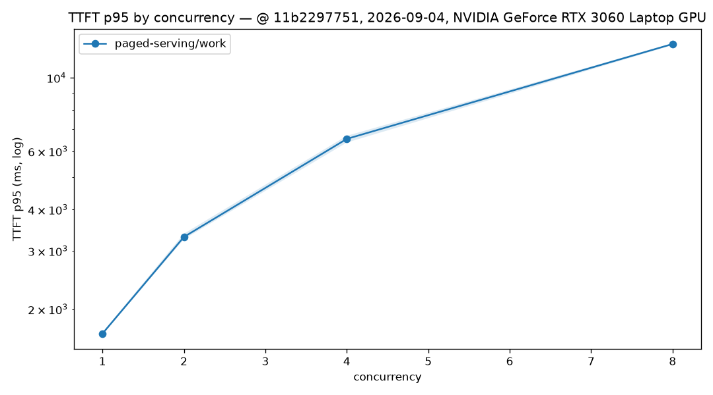
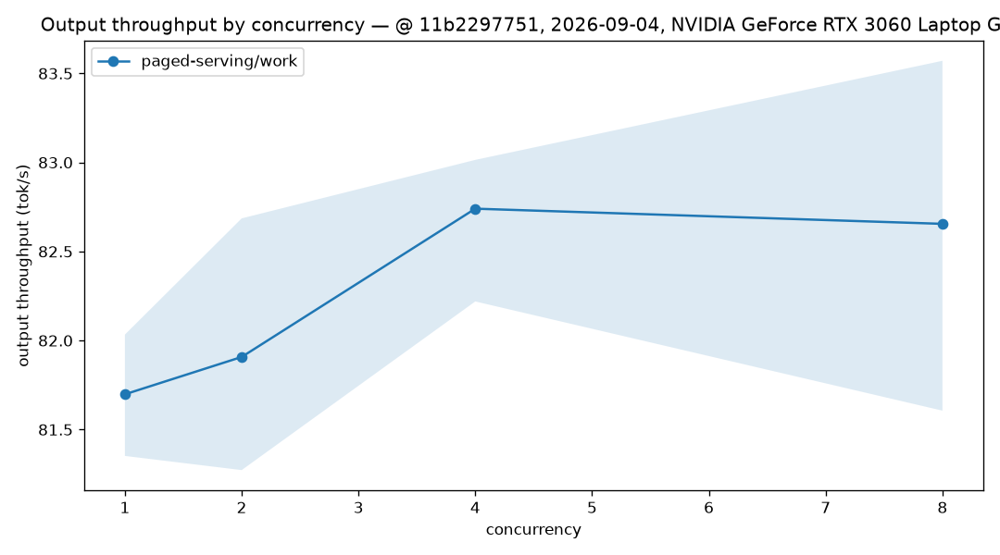
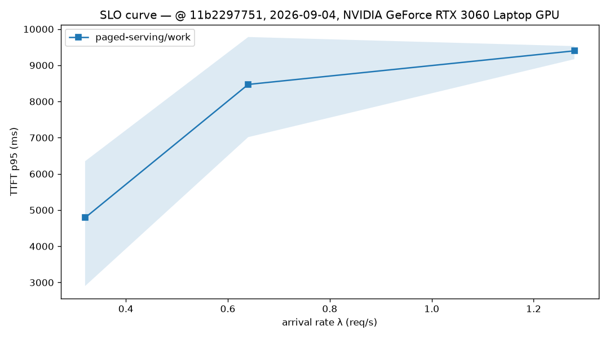

# RTX 3060 Laptop：paged-serving + tiny-llm 真实后端基准

## 范围与结论

- 日期：2026-09-04；发压机与服务同机。
- 硬件：NVIDIA GeForce RTX 3060 Laptop GPU（6144 MiB）、AMD Ryzen 7 5800H、
  NVIDIA driver 610.88、CUDA toolkit 12.0；这是笔记本 GPU 结果，不外推到桌面卡
  或数据中心 GPU。
- 被测代码：paged-serving `11b22977518f2fea31f99fa0c47933a354e7bddc`，
  tiny-llm `6df2c59b8db5ec409cf214a764e2f4eae84216d8`，两仓在 sweep 开始时均为
  clean worktree。
- 模型：`qwen2.5-0.5b-instruct-q4_k_m.gguf`，Q4_K_M，SHA-256
  `74a4da8c9fdbcd15bd1f6d01d621410d31c6fc00986f5eb687824e7b93d7a9db`；tokenizer
  为同工作区的 `models/tokenizer.json`。
- 结论仅适用于上述真实 CUDA 端到端路径和 `work` 合成数据集。closed-loop 从
  并发 1 提高到 8 时，输出吞吐保持约 82 tok/s，TTFT p95 从 1.69 s 升至
  12.65 s；因此当前实现证明了 8 并发的正确性和资源回收，但没有证明批处理
  吞吐扩展。Poisson 在约 1.0x 饱和请求容量（0.64 req/s）已经出现 429，2.0x
  时平均成功率仅 66.67%。

## 正确性门控

- release 二进制以 `--features tiny-llm` 构建，服务必须显式传入
  `--backend tiny-llm --model-path <gguf>`；该运行时选择由本次 P1 修复引入，避免
  仅启用 feature 时静默走 CPU reference。
- 启动后 `/healthz` 和 `/readyz` 均返回 200。2 并发、4 请求的 HTTP canary 全部
  成功；随后正式矩阵共归档 21 个 run 和 1,344 个提交请求。
- 所有成功请求的 completion token 来自最终 SSE 帧的 `usage` 字段，coverage 均为
  100%。没有以 SSE chunk 数估算 token 数。
- 当前服务对每个完成只发送一个非空文本 SSE chunk。因此本报告的 TTFT 实际接近
  整段 128-token 响应完成时间，不能当作真实 first-token latency；ITL 不可用。
  由 `(总耗时 - TTFT) / (tokens - 1)` 导出的 TPOT 接近 0，也不能用于解码速度主张。
- 本轮未运行 llama-server 或 vLLM 对照，因此没有任何跨引擎速度比值或排名结论。

## 负载与结果

共同参数：`work` 合成数据集（200 条）、greedy、`max_tokens=128`、每组合 64 个
测量请求、30 秒同形态预热、3 次重复。服务端配置为 `max_num_seqs=8`、
`max_batch_size=8`，并设置 `PAGED_SERVING_TINY_LLM_MAX_SEQS=8` 和
`PAGED_SERVING_TINY_LLM_DECODE_RESERVE=128`。

### Closed-loop

所有 closed-loop run 为 64/64 成功。表内 p95 和吞吐是三次均值，范围为重复的
min/max；完整逐请求记录见各 `paged-serving_closed_*` 目录。

| 并发 | TTFT p95 (ms) | p95 范围 (ms) | 输出吞吐 (tok/s) | 吞吐范围 (tok/s) |
| ---: | ---: | ---: | ---: | ---: |
| 1 | 1686.827 | 1675.224–1700.647 | 81.698 | 81.352–82.033 |
| 2 | 3304.502 | 3253.044–3380.517 | 81.908 | 81.272–82.686 |
| 4 | 6535.943 | 6371.392–6679.401 | 82.740 | 82.219–83.014 |
| 8 | 12647.559 | 12547.813–12711.629 | 82.655 | 81.606–83.571 |

closed-loop 三次重复的吞吐波动均低于 10%。并发 8 相比并发 1 仅增加约 1.2%
平均输出吞吐，却将 p95 放大约 7.5 倍；这是后续应优先剖析 C ABI/CUDA batch
执行路径的证据，而不是宣称 continuous batching 已经扩展。





### Poisson

closed-loop 的成功请求吞吐约 0.64 req/s，因此到达率设为 0.32、0.64、1.28 req/s，
对应约 0.5x、1.0x、2.0x。失败均以 HTTP 429 原样归档，而非从吞吐中剔除。

| 到达率 (req/s) | 成功率 | 429 总数 / 192 | TTFT p95 均值 (ms) | p95 范围 (ms) | 成功输出吞吐 (tok/s) |
| ---: | ---: | ---: | ---: | ---: | ---: |
| 0.32 | 100.00% | 0 | 4788.273 | 2902.119–6349.943 | 41.423 |
| 0.64 | 94.27% | 11 | 8470.164 | 7014.660–9780.500 | 78.012 |
| 1.28 | 66.67% | 64 | 9398.432 | 9168.446–9529.299 | 97.145 |

0.32 与 0.64 req/s 的 TTFT p95 run-to-run 波动超过 10%，不满足本项目的方法论
收敛门槛；其均值只作为探索性观测，不构成精确 SLO。Poisson 到达过程本身随机，
且每档只有 64 请求；后续应增加样本量并把 arrival seed 写入 metadata 后重跑。
1.28 req/s 的“成功输出吞吐”因大量 429 使服务拒绝了一部分工作，不能解释为容量
提升。



## 对照公平性与限制

- 这不是 llama.cpp/vLLM 对照，故没有同量化或完整路径比较。
- `Q4_K_M` 只描述当前 GGUF 后端；即使未来加入 FP16/W8A16 后端，也只能在模型、
  上下文、并发和生成参数完全对齐后讨论完整路径差异。
- KV 利用率采样、token 级 ITL、流式 first-token timestamp、prefix cache、抢占和
  chunked prefill 均未在本结果中实现或主张。
- 0.64/1.28 req/s 的 429 是当前 `max_num_seqs=8` 下的容量控制现象，不把它称为
  CUDA OOM；各 run 的 `summary.json` 与 `per_request.jsonl` 保留了准确计数。

## 完整复现

```bash
cd /home/shane/github/open-infra-ai/paged-serving
TINY_LLM_DIR=../tiny-llm/build cargo build --locked --release \\
  --features tiny-llm --bin paged-serving --bin loadgen

PAGED_SERVING_TINY_LLM_MAX_SEQS=8 \\
PAGED_SERVING_TINY_LLM_DECODE_RESERVE=128 \\
  ./target/release/paged-serving --serve --backend tiny-llm \\
  --model-path ../models/qwen2.5-0.5b-instruct-q4_k_m.gguf \\
  --tokenizer ../models/tokenizer.json --max-num-seqs 8 \\
  --max-batch-size 8 --port 3001

cd benchmarks/serving
./run_sweep.sh --base-url http://127.0.0.1:3001 --engine paged-serving \\
  --modes closed --concurrencies "1 2 4 8" --datasets work --requests 64 \\
  --warmup-secs 30 --max-tokens 128 --repeats 3 \\
  --tokenizer ../../../models/tokenizer.json \\
  --model-path ../../../models/qwen2.5-0.5b-instruct-q4_k_m.gguf \\
  --backend-quant Q4_K_M --cuda-archs 86 \\
  --results-dir results/2026-09-04-RTX3060Laptop-paged-serving

./run_sweep.sh --base-url http://127.0.0.1:3001 --engine paged-serving \\
  --modes poisson --rates "0.32 0.64 1.28" --datasets work --requests 64 \\
  --warmup-secs 30 --max-tokens 128 --repeats 3 \\
  --tokenizer ../../../models/tokenizer.json \\
  --model-path ../../../models/qwen2.5-0.5b-instruct-q4_k_m.gguf \\
  --backend-quant Q4_K_M --cuda-archs 86 \\
  --results-dir results/2026-09-04-RTX3060Laptop-paged-serving

python3 plots.py results/2026-09-04-RTX3060Laptop-paged-serving
python3 validate_results.py --formal results/2026-09-04-RTX3060Laptop-paged-serving
```

## 产物清单

- [x] `metadata.json`（硬件、软件、双仓 commit、clean 状态）
- [x] 21 个 run 的 `run_metadata.json`、`per_request.jsonl`、`summary.json`、`stdout.log`
- [x] `summary_table.csv` 与三张图
- [x] 模型 SHA-256、量化、tokenizer 与完整命令
- [x] 成功率、429、非收敛和协议限制说明
