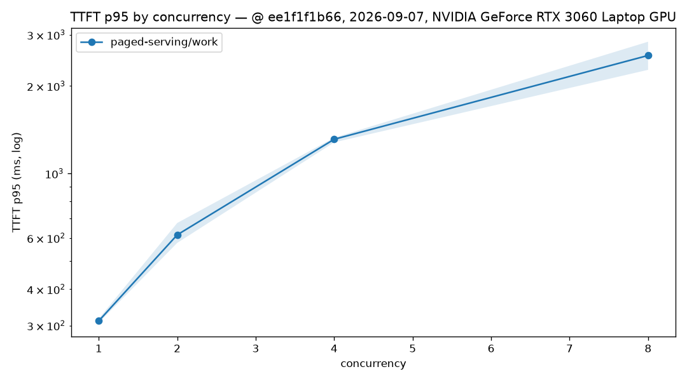
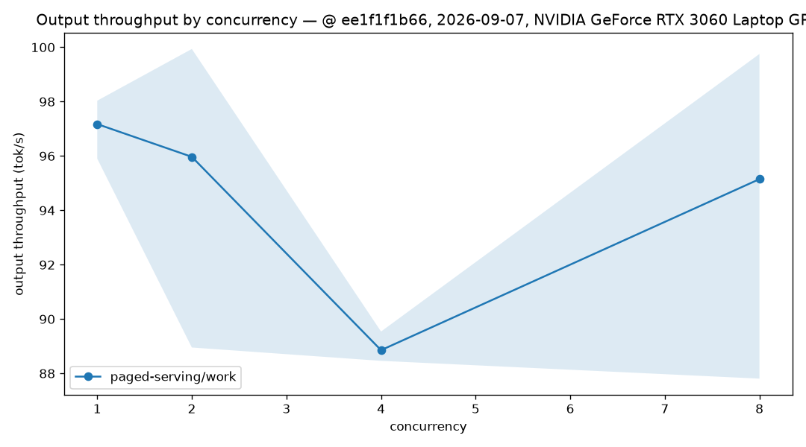
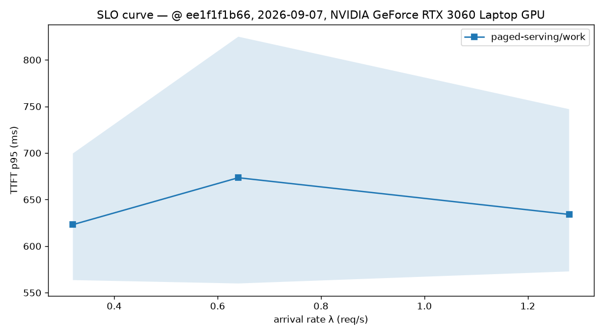

# RTX 3060 Laptop：批量末端后处理后的 paged-serving + tiny-llm P2 流式矩阵

## 范围与结论

- 日期：2026-09-07（sweep 起始日期）；服务与发压机在同一台机器。
- 硬件与软件：NVIDIA GeForce RTX 3060 Laptop GPU（6144 MiB）、NVIDIA driver
  610.88、CUDA toolkit 12.0、CUDA arch 86。CPU、GPU 时钟和功耗没有采集；笔记本的
  功耗墙、散热以及同机发压是本包口径的一部分，不能外推到桌面卡、数据中心 GPU 或独立
  网络压测。
- 被测代码：paged-serving `ee1f1f1b661fab5e19fad559c593b0bb7304e649`，tiny-llm
  `e3dc13bdec6edc69c437a48fb6ded6b5c58e757e`；sweep 启动时两仓均为 clean worktree。
- 模型：`qwen2.5-0.5b-instruct-q4_k_m.gguf`，SHA-256
  `74a4da8c9fdbcd15bd1f6d01d621410d31c6fc00986f5eb687824e7b93d7a9db`，tokenizer 为
  同工作区 `models/tokenizer.json`。GGUF 源文件是 Q4_K_M；tiny-llm 加载时将权重转换为
  W8A16 运行时路径（LM head 保留 FP16 路径），故本包的 `backend_quant` 记录为
  `W8A16`。

这是一份批量末端后处理之后的完整真实 CUDA HTTP 矩阵：closed-loop 的 12 个 run 都为
64/64 成功；Poisson 0.32 req/s 的三次也全部成功，而 0.64 与 1.28 req/s 分别累计出现
9 和 74 个 HTTP 429。它支持在上述硬件、模型、提交和负载下界定当前路径的成功率、
TTFT、TPOT、成功请求吞吐和准入拒绝边界；它不支持通用容量、稳定 SLO、跨引擎排名或
生产成熟度结论。

本包也**不**是批量末端后处理的 before/after 加速结论。2026-09-04 的 P2 包使用不同
提交，且其元数据将运行时量化口径记录为 Q4_K_M；本轮没有交替、配对的基线实验。更重要
的是，当前 FFI 只把每个序列末层 hidden 汇入 GPU batch buffer，批量执行 final RMSNorm、
LM head 和 greedy argmax 后一次回传 token；Transformer layer forward 仍逐序列执行。
因此不能把调度 batch 或这段末端输出批处理包装为 fused layer compute 或 continuous
batching 的吞吐扩展。

按项目的 `(max - min) / mean > 10%` 收敛门槛，closed c2/c8 的 TTFT p95 与吞吐均未
收敛，三档 Poisson 的 TTFT p95 均未收敛。所有均值、范围、失败和逐请求记录完整保留；
它们用于诚实定位边界，而不是挑选最佳 run 形成性能叙事。

## 正确性门控

- 服务以 `--features tiny-llm` 的 release 二进制构建，并显式以
  `--backend tiny-llm --model-path <gguf>` 启动；矩阵中的 1261 个成功 HTTP 请求证明该
  显式真实后端路径在测量期间可用。`/healthz` 与 `/readyz` 没有作为单独请求归档，故本包
  不把它们写成已采集的健康检查证据。
- 21 个 run 合计提交 1344 个请求，1261 个成功、83 个失败；失败分类全部为 Poisson
  准入阶段的 `http_429`，没有 timeout、连接、SSE 流或其他 HTTP 失败分类。
- 每个成功请求都从最终 SSE `usage` 获得 completion token；1261/1261 成功请求的 token
  coverage 均为 100%。在此模型和负载下，每个成功请求记录到 128 个非空文本 chunk；这不
  是对所有 tokenizer、特殊 token 或输出内容的“一 token 一 chunk”承诺。
- TTFT 是第一个非空文本 SSE chunk 的到达延迟。`inter-chunk latency` 只描述相邻非空
  协议片段的到达间隔，**不是** token 级 ITL；协议未提供 token 时间戳，ITL 始终记为
  不可用。

## 负载与结果

共同参数：`work` 合成数据集（200 条）、greedy、`max_tokens=128`、每组合 64 个测量
请求、30 秒同形态预热、3 次重复。服务端配置为 `max_num_seqs=8`、`max_batch_size=8`，
环境为 `PAGED_SERVING_TINY_LLM_MAX_SEQS=8` 和
`PAGED_SERVING_TINY_LLM_DECODE_RESERVE=128`。每个 Poisson repeat 的到达种子依次为
20260904、20260905、20260906；种子固定计划到达间隔，不能消除 GPU 与系统调度抖动。

### Closed-loop

下表的 p95、chunk p50、TPOT 和吞吐为三次均值；范围为三次 min/max。所有 12 个 run 都
是 64/64 成功、无 429、token coverage 100%。`chunk p50` 不是 ITL。

| 并发 | TTFT p95 (ms) | p95 范围 (ms) | chunk p50 (ms) | TPOT p50 (ms) | 输出吞吐 (tok/s) | 吞吐范围 (tok/s) |
| ---: | ---: | ---: | ---: | ---: | ---: | ---: |
| 1 | 310.985 | 306.556–316.475 | 7.429 | 8.308 | 97.173 | 95.902–98.035 |
| 2 | 614.845 | 576.860–675.407 | 15.284 | 16.943 | 95.969 | 88.954–99.937 |
| 4 | 1310.773 | 1279.120–1327.187 | 33.716 | 35.865 | 88.856 | 88.463–89.542 |
| 8 | 2545.367 | 2271.551–2837.912 | 62.232 | 66.798 | 95.149 | 87.809–99.754 |

TTFT p95 的 run-to-run 波动依次为 3.19% / 16.03% / 3.67% / 22.25%；吞吐波动为
2.20% / 11.44% / 1.21% / 12.55%。因此 c1 与 c4 同时满足这两个收敛检查，c2 与 c8
没有；均值只用于描述本包边界。随并发提高，平均 TTFT p95 从 310.985 ms 升至
2545.367 ms，而成功请求输出吞吐没有显示随并发扩展的证据。





### Poisson

下表的吞吐仅统计成功请求，不能因高到达率下剩余成功请求的吞吐较高而解释为容量提升。

| 到达率 (req/s) | 成功率 | 429 总数 / 192 | TTFT p95 (ms) | p95 范围 (ms) | chunk p50 (ms) | 成功输出吞吐 (tok/s) | 吞吐范围 (tok/s) |
| ---: | ---: | ---: | ---: | ---: | ---: | ---: | ---: |
| 0.32 | 100.000% | 0 | 623.085 | 563.551–699.525 | 13.880 | 43.389 | 38.324–47.132 |
| 0.64 | 95.312% | 9 | 673.470 | 559.918–824.906 | 31.055 | 79.880 | 73.388–85.790 |
| 1.28 | 61.458% | 74 | 634.058 | 572.847–747.080 | 50.337 | 96.476 | 96.158–96.635 |

三档 TTFT p95 的 run-to-run 波动为 21.82% / 39.35% / 27.48%，均超过 10% 门槛；0.32 与
0.64 的吞吐波动也分别为 20.30% / 15.53%。0.64 req/s 已重复出现 429，1.28 req/s 的
429 明显增多；它们是当前 `max_num_seqs=8` 配置下的准入拒绝证据，不能被成功请求的
吞吐均值掩盖。



## 对照公平性与限制

- 本包没有运行 llama-server 或 vLLM，因此没有跨引擎速度比值、排名或同量化对照。
- 2026-09-04 P2 包与本包均使用同一 GGUF 文件哈希和硬件口径，但提交不同，且运行时量化
  元数据口径不同；没有配对/交替执行，不能将差异归因于批量末端后处理。
- 发压机和服务同机，未采集 GPU 时钟、功耗、温度或独立网络时延；这些是后续冷却、锁频和
  独立发压机复跑的优先改进项。
- 当前 normal-greedy FFI 的 final RMSNorm、LM head、argmax 与 token 回传已经批量化，
  但 Transformer layer forward、attention/KV 视图和 RoPE 位置处理仍逐序列。没有
  ragged layer batch compute、prefix cache、抢占、chunked prefill、KV 利用率采样或
  token 级 ITL；不得用推测补全这些能力。

## 完整复现

```bash
cd /home/shane/github/open-infra-ai/paged-serving
TINY_LLM_DIR=/home/shane/github/open-infra-ai/tiny-llm/build \
  cargo build --locked --release --features tiny-llm \
  --bin paged-serving --bin loadgen

PAGED_SERVING_TINY_LLM_MAX_SEQS=8 \
PAGED_SERVING_TINY_LLM_DECODE_RESERVE=128 \
  ./target/release/paged-serving --serve --backend tiny-llm \
  --model-path /home/shane/github/open-infra-ai/models/qwen2.5-0.5b-instruct-q4_k_m.gguf \
  --tokenizer /home/shane/github/open-infra-ai/models/tokenizer.json \
  --max-num-seqs 8 --max-batch-size 8 --host 127.0.0.1 --port 3005

cd benchmarks/serving
./run_sweep.sh --base-url http://127.0.0.1:3005 --engine paged-serving \
  --model paged-serving --modes 'closed poisson' --concurrencies '1 2 4 8' \
  --rates '0.32 0.64 1.28' --datasets work --requests 64 --warmup-secs 30 \
  --max-tokens 128 --repeats 3 \
  --model-path ../../../models/qwen2.5-0.5b-instruct-q4_k_m.gguf \
  --backend-quant W8A16 --tokenizer ../../../models/tokenizer.json --cuda-archs 86 \
  --poisson-seed 20260904 \
  --results-dir results/2026-09-07-RTX3060Laptop-paged-serving-p2-batch-postprocess-streaming \
  --tiny-llm-dir ../../../tiny-llm

python3 plots.py results/2026-09-07-RTX3060Laptop-paged-serving-p2-batch-postprocess-streaming
python3 validate_results.py --formal \
  results/2026-09-07-RTX3060Laptop-paged-serving-p2-batch-postprocess-streaming
```

## 产物清单

- [x] `metadata.json`
- [x] 21 个 run 的 `run_metadata.json`、`per_request.jsonl`、`summary.json`、`stdout.log`
- [x] `summary_table.csv`、closed-loop 图表与 Poisson SLO 图
- [x] 模型 SHA-256、双仓 commit、GPU、驱动、CUDA 与构建 arch
- [x] 本报告中的结论、限制、83 个 HTTP 429 与未收敛重复说明
