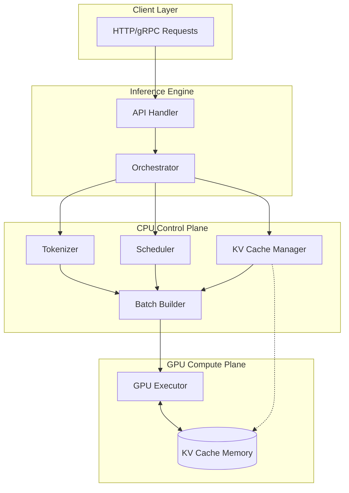
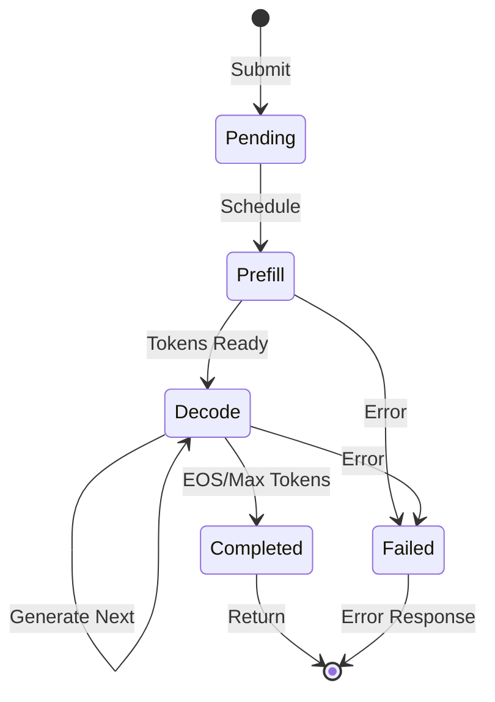
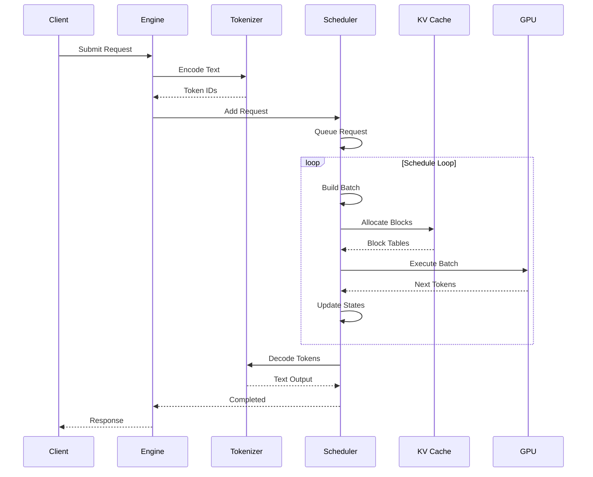
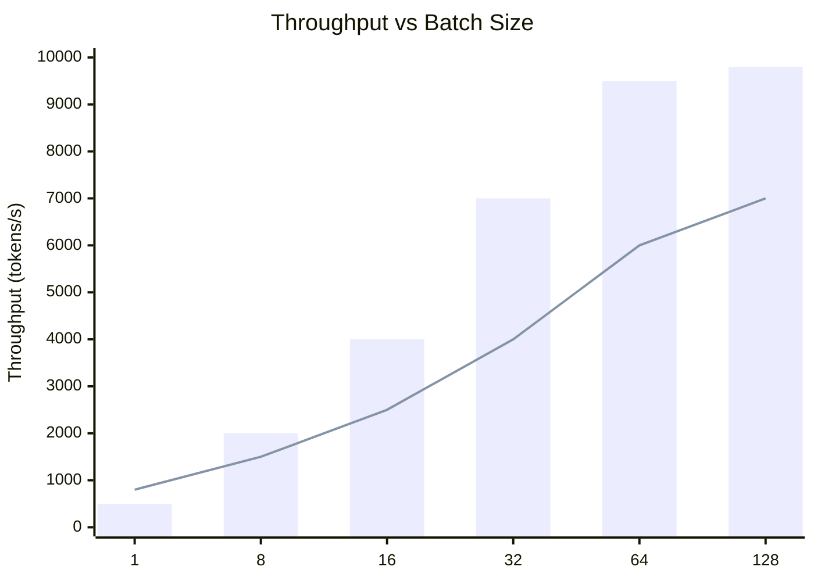
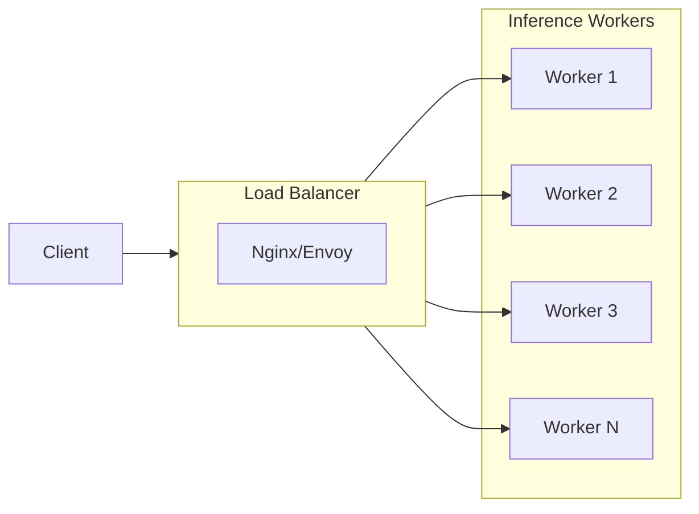

# Architecture Overview

## Design Philosophy

Hetero-Paged-Infer implements a **heterogeneous computing architecture** that separates control flow (CPU) from compute-intensive operations (GPU).

### Core Principles

1. **CPU Orchestration** - Scheduling, memory management, batch preparation
2. **GPU Computation** - Attention kernels, matrix operations, token generation
3. **Memory Efficiency** - PagedAttention eliminates memory waste
4. **Throughput Optimization** - Continuous batching maximizes GPU utilization

## High-Level Architecture



## Component Breakdown

### 1. Inference Engine

The main orchestrator that coordinates all components:

```rust
pub struct InferenceEngine {
    config: EngineConfig,
    tokenizer: Box<dyn TokenizerTrait>,
    scheduler: Box<dyn SchedulerTrait>,
    kv_cache_manager: Box<dyn KVCacheManagerTrait>,
    gpu_executor: Box<dyn GPUExecutorTrait>,
}
```

**Responsibilities:**
- Request lifecycle management
- Step-by-step execution loop
- Error recovery strategies
- Metrics collection

### 2. Scheduler

Implements **Continuous Batching** with decode priority:



**Scheduling Algorithm:**

```
1. Collect decode requests (highest priority)
2. Fill remaining batch slots with prefill
3. Respect memory and size constraints
4. Update request states
```

### 3. KV Cache Manager

Implements **PagedAttention** memory management:

```
┌─────────────────────────────────────────────────────────────┐
│                    GPU Memory Pool                           │
├─────────────────────────────────────────────────────────────┤
│ Block 0 │ Block 1 │ Block 2 │ ... │ Block N                  │
│ [K,V]   │ [K,V]   │ [K,V]   │     │ [K,V]                    │
└─────────────────────────────────────────────────────────────┘
      ↑
Page Table Mapping:
  Sequence 0: [Block 3] → [Block 7] → [Block 12]
  Sequence 1: [Block 1] → [Block 5] → [Block 9]
```

### 4. GPU Executor

Abstracts GPU computation:

```rust
pub trait GPUExecutorTrait {
    fn execute(&mut self, batch: &ExecutionBatch) 
        -> ExecutionOutput;
    fn capture_decode_graph(&mut self, batch_size: u32);
    fn execute_graph(&mut self, batch: &ExecutionBatch) 
        -> ExecutionOutput;
}
```

## Data Flow

### Request Processing Pipeline



## Memory Model

### Block Structure

```rust
pub struct PhysicalBlock {
    block_id: u32,
    refcount: u32,
    data: *mut c_void,  // GPU memory pointer
}

pub struct LogicalBlock {
    logical_idx: u32,
    physical: Option<PhysicalBlockRef>,
}
```

### Memory Layout

```
Token Positions:
┌─────────────────────────────────────────────────────┐
│ Block 0 │ Block 1 │ Block 2 │ Block 3 │ Block 4     │
│ 0-15    │ 16-31   │ 32-47   │ 48-63   │ 64-79       │
└─────────────────────────────────────────────────────┘

Attention Mask (Causal):
┌───┬───┬───┬───┬───┐
│ 1 │ 0 │ 0 │ 0 │ 0 │  Position 0
├───┼───┼───┼───┼───┤
│ 1 │ 1 │ 0 │ 0 │ 0 │  Position 1
├───┼───┼───┼───┼───┤
│ 1 │ 1 │ 1 │ 0 │ 0 │  Position 2
├───┼───┼───┼───┼───┤
│ 1 │ 1 │ 1 │ 1 │ 0 │  Position 3
├───┼───┼───┼───┼───┤
│ 1 │ 1 │ 1 │ 1 │ 1 │  Position 4
└───┴───┴───┴───┴───┘
```

## Performance Characteristics

### Throughput vs Latency



### Memory Efficiency

| Method | Internal Waste | External Frag | Total |
|--------|---------------|---------------|-------|
| Static | 45% | 10% | 55% |
| Dynamic | 20% | 8% | 28% |
| **Paged** | **<5%** | **<2%** | **<7%** |

## Scalability

### Horizontal Scaling



### Vertical Scaling

- More GPU memory → More concurrent sequences
- More CPU cores → Faster batch preparation
- Larger batch size → Better GPU utilization

## Security Considerations

1. **Resource Isolation** - Per-request memory limits
2. **Input Validation** - Token count limits
3. **Timeout Handling** - Prevent hung requests
4. **Error Boundaries** - Isolate failed requests

---

Next: [Component Details](components.md)
