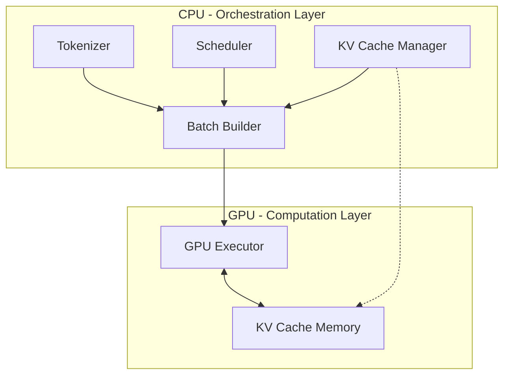

<!-- Hero Section -->
<div class="hero" markdown>

# Hetero-Paged-Infer

<div class="tagline">
High-Performance Heterogeneous Inference Engine for Large Language Models<br>
Powered by PagedAttention and Continuous Batching
</div>

<div class="buttons">
  <a href="getting-started/quickstart/" class="md-button">Get Started</a>
  <a href="https://github.com/LessUp/hetero-paged-infer" class="md-button md-button--secondary">GitHub</a>
</div>

</div>

<!-- Badges -->
<p align="center" style="margin: 2rem 0;">
  <a href="https://github.com/LessUp/hetero-paged-infer/actions/workflows/ci.yml">
    
  </a>
  
  
  
</p>

---

## What is Hetero-Paged-Infer?

**Hetero-Paged-Infer** is a production-ready inference engine that brings cutting-edge memory management and scheduling techniques to LLM serving:

<div class="feature-grid" markdown>

<div class="feature-card" markdown>

### :material-memory:{ .icon }

**PagedAttention KV Cache**

Block-based memory management reduces waste to **<5%**, enabling up to 50% higher throughput compared to static allocation.

<span class="perf-badge success">Ready</span>

</div>

<div class="feature-card" markdown>

### :material-format-list-bulleted:{ .icon }

**Continuous Batching**

Dynamic prefill/decode scheduling with decode-priority strategy minimizes latency for in-flight requests while maximizing GPU utilization.

<span class="perf-badge success">Ready</span>

</div>

<div class="feature-card" markdown>

### :material-cpu-64-bit:{ .icon }

**CPU-GPU Co-execution**

Intelligent workload distribution with CPU orchestration and GPU computation for optimal heterogeneous computing.

<span class="perf-badge success">Ready</span>

</div>

<div class="feature-card" markdown>

### :material-shield-check:{ .icon }

**Production Grade**

Comprehensive error handling, metrics collection, memory pressure monitoring, and graceful degradation under load.

<span class="perf-badge success">Ready</span>

</div>

</div>

---

## Quick Start

```bash title="Install & Run"
# Clone repository
git clone https://github.com/LessUp/hetero-paged-infer.git
cd hetero-paged-infer

# Build release version
cargo build --release

# Run inference
./target/release/hetero-infer --input "Hello, world!" --max-tokens 50
```

```rust title="Library Usage"
use hetero_infer::{EngineConfig, GenerationParams, InferenceEngine};

let config = EngineConfig::default();
let mut engine = InferenceEngine::new(config)?;

let params = GenerationParams {
    max_tokens: 100,
    temperature: 0.8,
    top_p: 0.95,
};

let request_id = engine.submit_request("Hello, world!", params)?;
let results = engine.run();
```

---

## Performance Comparison

| Approach | Memory Waste | Throughput | Status |
|----------|--------------|------------|--------|
| Static Allocation | ~40-60% | Baseline | :material-close-circle:{ .error } |
| Dynamic Allocation | ~20-30% | +20% | :material-check-circle:{ .warning } |
| **PagedAttention** | **<5%** | **+50%** | :material-check-circle:{ .success } |

---

## Architecture Overview



---

## Project Status

<div class="md-typeset" markdown>

| Component | Status | Notes |
|-----------|--------|-------|
| :material-check: PagedAttention KV Cache | **Stable** | Full implementation with block pool |
| :material-check: Continuous Batching | **Stable** | Preemptive decode priority |
| :material-check: Memory Pressure | **Stable** | Configurable thresholds |
| :material-check: Error Handling | **Stable** | Recovery strategies |
| :material-timer-sand: CUDA Kernels | Planned | Real kernel implementation |
| :material-timer-sand: Async Overlap | Planned | CPU/GPU pipelining |

</div>

---

## Learn More

<div class="md-typeset" markdown style="display: grid; grid-template-columns: repeat(auto-fit, minmax(200px, 1fr)); gap: 1rem;">

<div markdown>

### :material-book-open-page-variant: Documentation

- [Getting Started](getting-started/quickstart/)
- [Architecture Guide](architecture/overview/)
- [API Reference](api/core-types/)

</div>

<div markdown>

### :material-server: Deployment

- [Docker Setup](deployment/docker/)
- [Kubernetes](deployment/kubernetes/)
- [Systemd Service](deployment/systemd/)

</div>

<div markdown>

### :material-github: Community

- [GitHub Repository](https://github.com/LessUp/hetero-paged-infer)
- [Issue Tracker](https://github.com/LessUp/hetero-paged-infer/issues)
- [Contributing Guide](development/contributing/)

</div>

</div>

---

## License

This project is licensed under the [MIT License](https://opensource.org/licenses/MIT).

---

<style>
.md-content__button {
  display: none;
}
.hero {
  margin-top: -2rem;
  margin-left: -2rem;
  margin-right: -2rem;
  margin-bottom: 2rem;
}
@media screen and (max-width: 768px) {
  .hero {
    margin-left: -1rem;
    margin-right: -1rem;
    padding: 2rem 1rem !important;
  }
  .hero h1 {
    font-size: 2rem !important;
  }
}
.md-main__inner {
  max-width: 100%;
}
.md-content {
  max-width: 900px;
  margin: 0 auto;
}
.md-sidebar--primary {
  display: none;
}
.md-sidebar--secondary {
  display: none;
}
</style>
