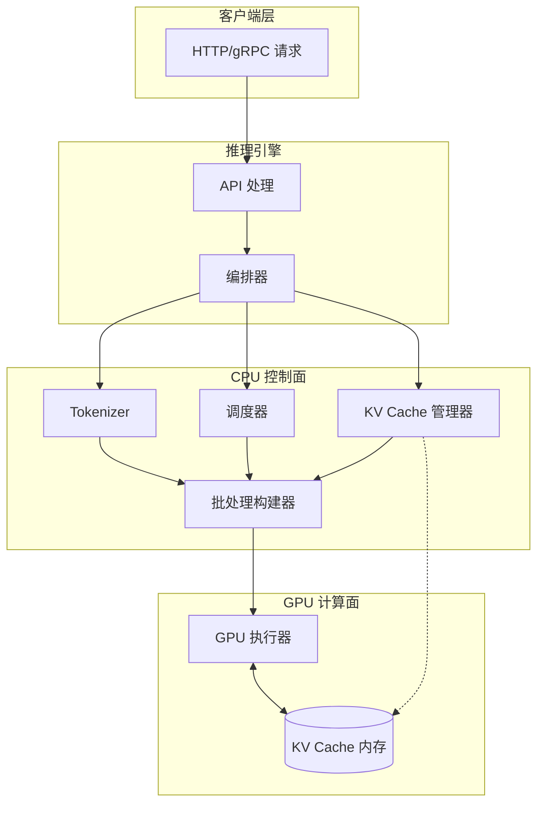
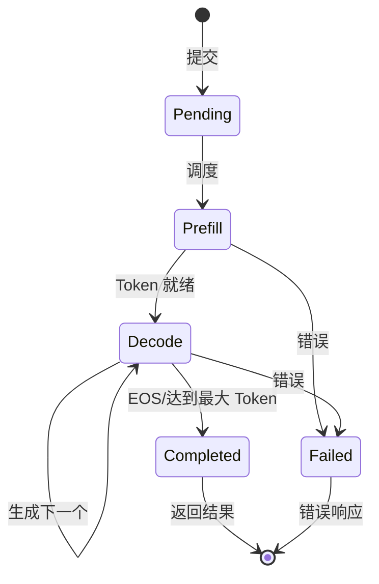
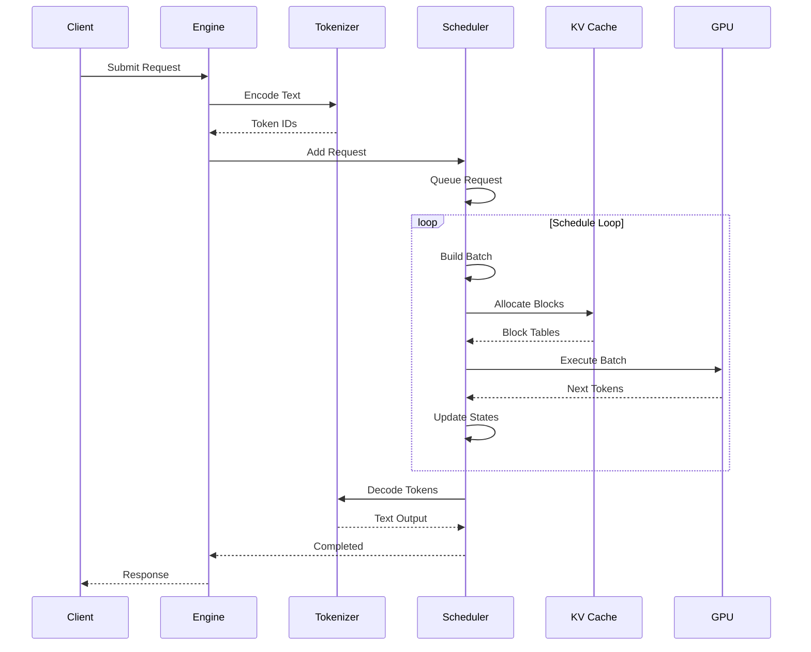
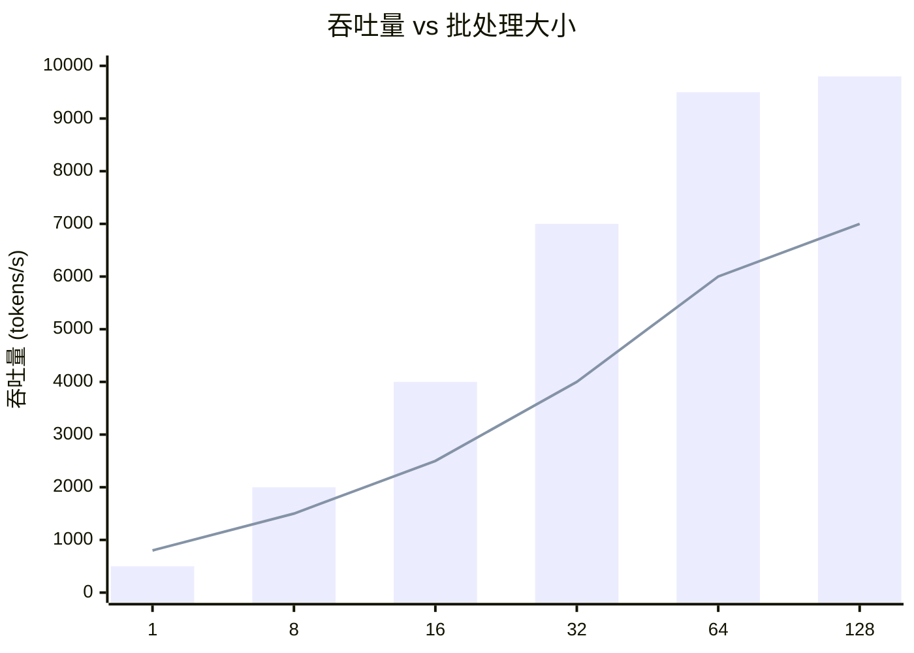
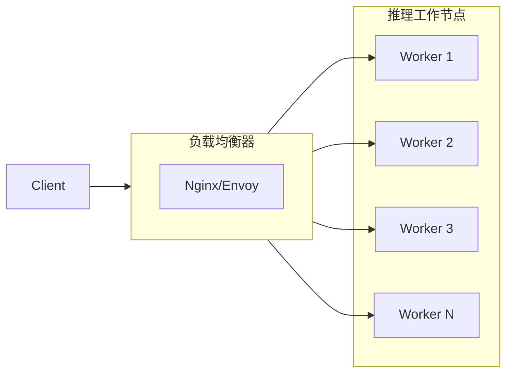

# 架构概览

## 设计理念

Hetero-Paged-Infer 实现了一种**异构计算架构**，将控制流（CPU）与计算密集型操作（GPU）分离。

### 核心原则

1. **CPU 协调** — 调度、内存管理、批处理准备
2. **GPU 计算** — Attention 内核、矩阵运算、Token 生成
3. **内存效率** — PagedAttention 消除内存浪费
4. **吞吐优化** — 连续批处理最大化 GPU 利用率

## 高层架构



## 组件详解

### 1. 推理引擎

协调所有组件的主编排器：

```rust
pub struct InferenceEngine {
    config: EngineConfig,
    tokenizer: Box<dyn TokenizerTrait>,
    scheduler: Box<dyn SchedulerTrait>,
    kv_cache_manager: Box<dyn KVCacheManagerTrait>,
    gpu_executor: Box<dyn GPUExecutorTrait>,
}
```

**职责：**
- 请求生命周期管理
- 逐步执行循环
- 错误恢复策略
- 指标数据收集

### 2. 调度器

实现带有 Decode 优先的**连续批处理**：



**调度算法：**

```
1. 收集 Decode 请求（最高优先级）
2. 用 Prefill 请求填充剩余批处理槽位
3. 遵守内存和大小约束
4. 更新请求状态
```

### 3. KV Cache 管理器

实现 **PagedAttention** 内存管理：

```
┌─────────────────────────────────────────────────────────────┐
│                    GPU 内存池                                │
├─────────────────────────────────────────────────────────────┤
│ Block 0 │ Block 1 │ Block 2 │ ... │ Block N                  │
│ [K,V]   │ [K,V]   │ [K,V]   │     │ [K,V]                    │
└─────────────────────────────────────────────────────────────┘
      ↑
页表映射：
  Sequence 0: [Block 3] → [Block 7] → [Block 12]
  Sequence 1: [Block 1] → [Block 5] → [Block 9]
```

### 4. GPU 执行器

抽象 GPU 计算：

```rust
pub trait GPUExecutorTrait {
    fn execute(&mut self, batch: &ExecutionBatch)
        -> ExecutionOutput;
    fn capture_decode_graph(&mut self, batch_size: u32);
    fn execute_graph(&mut self, batch: &ExecutionBatch)
        -> ExecutionOutput;
}
```

## 数据流

### 请求处理流水线



## 内存模型

### 块结构

```rust
pub struct PhysicalBlock {
    block_id: u32,
    refcount: u32,
    data: *mut c_void,  // GPU memory pointer
}

pub struct LogicalBlock {
    logical_idx: u32,
    physical: Option<PhysicalBlockRef>,
}
```

### 内存布局

```
Token Positions:
┌─────────────────────────────────────────────────────┐
│ Block 0 │ Block 1 │ Block 2 │ Block 3 │ Block 4     │
│ 0-15    │ 16-31   │ 32-47   │ 48-63   │ 64-79       │
└─────────────────────────────────────────────────────┘

Attention Mask (Causal):
┌───┬───┬───┬───┬───┐
│ 1 │ 0 │ 0 │ 0 │ 0 │  Position 0
├───┼───┼───┼───┼───┤
│ 1 │ 1 │ 0 │ 0 │ 0 │  Position 1
├───┼───┼───┼───┼───┤
│ 1 │ 1 │ 1 │ 0 │ 0 │  Position 2
├───┼───┼───┼───┼───┤
│ 1 │ 1 │ 1 │ 1 │ 0 │  Position 3
├───┼───┼───┼───┼───┤
│ 1 │ 1 │ 1 │ 1 │ 1 │  Position 4
└───┴───┴───┴───┴───┘
```

## 性能特征

### 吞吐 vs 延迟



### 内存效率

| 方法 | 内部浪费 | 外部碎片 | 总计 |
|------|---------|---------|------|
| 静态 | 45% | 10% | 55% |
| 动态 | 20% | 8% | 28% |
| **Paged** | **<5%** | **<2%** | **<7%** |

## 可扩展性

### 水平扩展



### 垂直扩展

- 更多 GPU 内存 → 更多并发序列
- 更多 CPU 核心 → 更快的批处理准备
- 更大的批处理大小 → 更好的 GPU 利用率

## 安全考量

1. **资源隔离** — 每个请求的内存限制
2. **输入验证** — Token 数量限制
3. **超时处理** — 防止请求挂起
4. **错误边界** — 隔离失败的请求

---

下一步：[组件详情](components.md)
