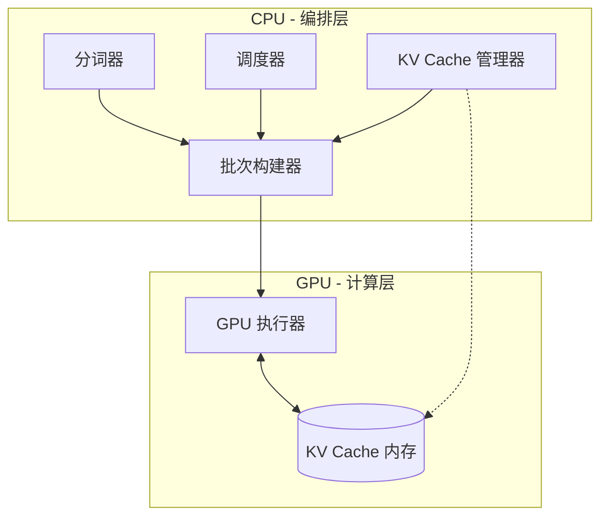

<!-- Hero Section -->
<div class="hero" markdown>

# Hetero-Paged-Infer

<div class="tagline">
高性能异构推理引擎，支持大语言模型 CPU-GPU 协同执行<br>
采用分页式注意力与连续批处理技术
</div>

<div class="buttons">
  <a href="getting-started/quickstart/" class="md-button">快速开始</a>
  <a href="https://github.com/LessUp/hetero-paged-infer" class="md-button md-button--secondary">GitHub</a>
</div>

</div>

<!-- Badges -->
<p align="center" style="margin: 2rem 0;">
  <a href="https://github.com/LessUp/hetero-paged-infer/actions/workflows/ci.yml">
    
  </a>
  
  
  
</p>

---

## 项目介绍

**Hetero-Paged-Infer** 是一个生产级推理引擎，将前沿的内存管理和调度技术引入 LLM 服务：

<div class="feature-grid" markdown>

<div class="feature-card" markdown>

### :material-memory:{ .icon }

**分页式注意力 KV Cache**

基于块的内存管理将浪费降至 **<5%**，相比静态分配可提升多达 50% 的吞吐率。

<span class="perf-badge success">已就绪</span>

</div>

<div class="feature-card" markdown>

### :material-format-list-bulleted:{ .icon }

**连续批处理**

动态预填充/解码调度，采用解码优先策略，最小化在途请求延迟，最大化 GPU 利用率。

<span class="perf-badge success">已就绪</span>

</div>

<div class="feature-card" markdown>

### :material-cpu-64-bit:{ .icon }

**CPU-GPU 协同执行**

智能工作负载分配，CPU 编排与 GPU 计算相结合，实现最优异构计算。

<span class="perf-badge success">已就绪</span>

</div>

<div class="feature-card" markdown>

### :material-shield-check:{ .icon }

**生产级品质**

全面的错误处理、指标收集、内存压力监控，以及高负载下的优雅降级。

<span class="perf-badge success">已就绪</span>

</div>

</div>

---

## 快速开始

```bash title="安装与运行"
# 克隆仓库
git clone https://github.com/LessUp/hetero-paged-infer.git
cd hetero-paged-infer

# 构建发布版本
cargo build --release

# 运行推理
./target/release/hetero-infer --input "你好，世界！" --max-tokens 50
```

```rust title="库用法"
use hetero_infer::{EngineConfig, GenerationParams, InferenceEngine};

let config = EngineConfig::default();
let mut engine = InferenceEngine::new(config)?;

let params = GenerationParams {
    max_tokens: 100,
    temperature: 0.8,
    top_p: 0.95,
};

let request_id = engine.submit_request("你好，世界！", params)?;
let results = engine.run();
```

---

## 性能对比

| 方案 | 内存浪费 | 吞吐率 | 状态 |
|------|----------|--------|------|
| 静态分配 | ~40-60% | 基准 | :material-close-circle:{ .error } |
| 动态分配 | ~20-30% | +20% | :material-check-circle:{ .warning } |
| **分页式注意力** | **<5%** | **+50%** | :material-check-circle:{ .success } |

---

## 架构概览



---

## 项目状态

<div class="md-typeset" markdown>

| 组件 | 状态 | 说明 |
|------|------|------|
| :material-check: 分页式注意力 KV Cache | **稳定** | 完整实现，含块池 |
| :material-check: 连续批处理 | **稳定** | 抢占式解码优先 |
| :material-check: 内存压力感知 | **稳定** | 可配置阈值 |
| :material-check: 错误处理 | **稳定** | 恢复策略 |
| :material-timer-sand: CUDA Kernel | 规划中 | 真实 kernel 实现 |
| :material-timer-sand: 异步重叠 | 规划中 | CPU/GPU 流水线 |

</div>

---

## 了解更多

<div class="md-typeset" markdown style="display: grid; grid-template-columns: repeat(auto-fit, minmax(200px, 1fr)); gap: 1rem;">

<div markdown>

### :material-book-open-page-variant: 文档

- [快速入门](getting-started/quickstart/)
- [架构指南](architecture/overview/)
- [API 参考](api/core-types/)

</div>

<div markdown>

### :material-server: 部署

- [Docker 部署](deployment/docker/)
- [Kubernetes](deployment/kubernetes/)
- [Systemd 服务](deployment/systemd/)

</div>

<div markdown>

### :material-github: 社区

- [GitHub 仓库](https://github.com/LessUp/hetero-paged-infer)
- [问题追踪](https://github.com/LessUp/hetero-paged-infer/issues)
- [贡献指南](development/contributing/)

</div>

</div>

---

## 许可证

本项目采用 [MIT 许可证](https://opensource.org/licenses/MIT)。

---

<style>
.md-content__button {
  display: none;
}
.hero {
  margin-top: -2rem;
  margin-left: -2rem;
  margin-right: -2rem;
  margin-bottom: 2rem;
}
@media screen and (max-width: 768px) {
  .hero {
    margin-left: -1rem;
    margin-right: -1rem;
    padding: 2rem 1rem !important;
  }
  .hero h1 {
    font-size: 2rem !important;
  }
}
.md-main__inner {
  max-width: 100%;
}
.md-content {
  max-width: 900px;
  margin: 0 auto;
}
.md-sidebar--primary {
  display: none;
}
.md-sidebar--secondary {
  display: none;
}
</style>
